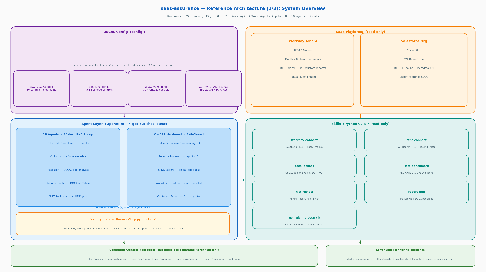
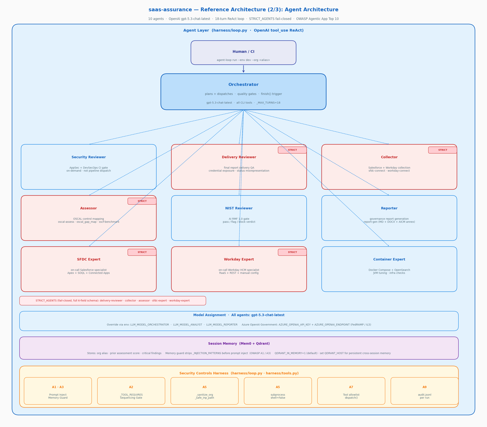
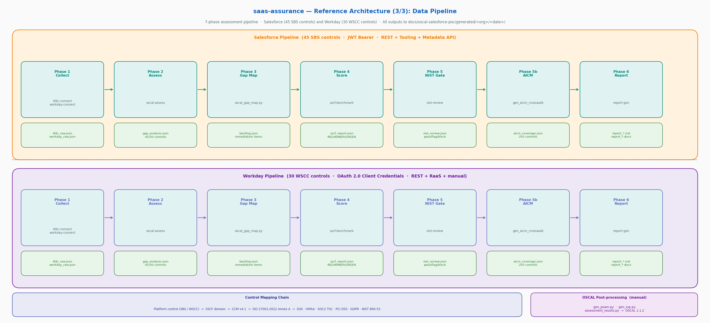

# Architecture Overview

## Reference Architecture Diagrams

Three focused views replace the single monolithic diagram. Each view has a **matplotlib** (A-series, full colour detail) and a **diagrams-lib** (B-series, auto-layout) variant.

| # | Topic | Matplotlib (A) | diagrams-lib (B) |
|---|---|---|---|
| 1 | System Overview — all 6 sections at a glance | `docs/arch-a1-overview.png` | `docs/arch-b1-overview.png` |
| 2 | Agent Architecture — orchestrator, 9 agents, OWASP harness | `docs/arch-a2-agents.png` | `docs/arch-b2-agents.png` |
| 3 | Data Pipeline — 7-phase swim-lanes + control chain | `docs/arch-a3-pipeline.png` | `docs/arch-b3-pipeline.png` |

Regenerate locally:
```bash
python3 scripts/gen_arch_a1_overview.py   # System Overview (matplotlib)
python3 scripts/gen_arch_a2_agents.py     # Agent Architecture (matplotlib)
python3 scripts/gen_arch_a3_pipeline.py   # Data Pipeline (matplotlib)
python3 scripts/gen_arch_b1_overview.py   # System Overview (diagrams lib)
python3 scripts/gen_arch_b2_agents.py     # Agent Architecture (diagrams lib)
python3 scripts/gen_arch_b3_pipeline.py   # Data Pipeline (diagrams lib)
```

### System Overview (1/3)



### Agent Architecture (2/3)



### Data Pipeline (3/3)



---

## Design Philosophy

**CLIs not MCPs.** Every tool is a Python CLI callable from the shell. No hidden service state. No Docker-required infrastructure. The agent loop is an OpenAI `tool_use` ReAct loop.

---

## System Diagram

```
┌─────────────────────────────────────────────────────────────────────────────┐
│         agent-loop  (gpt-5.3-chat-latest orchestrator)                      │
│         OpenAI tool_use ReAct loop · max 14 turns · 10 agents · 7 tools     │
│                                                                              │
│  Security Harness (harness/loop.py · harness/tools.py)                      │
│    _TOOL_REQUIRES sequencing gate · memory guard · audit.jsonl · path valid  │
│    OWASP Agentic App Top 10 hardened (A1-A9 mitigated)                       │
└──┬──────────┬──────────┬──────────┬──────────┬──────────┬──────────────────┘
   │          │          │          │          │          │
   │ Phase 1  │ Phase 2  │ Phase 3  │ Phase 4  │ Phase 5  │ Phase 5b
   ▼          ▼          ▼          ▼          ▼          ▼
sfdc-      workday-   oscal-     oscal_    sscf-      nist-      gen_aicm_
connect    connect    assess     gap_map   benchmark  review     crosswalk
(SFDC)     (WD)       (assess)   (map)     (score)    (gate)     (AICM v1.0.3)
   │          │          │           │          │          │          │
sfdc_raw  workday_raw gap_analysis backlog  sscf_report nist_review aicm_coverage
 .json      .json       .json       .json     .json       .json       .json
   └──────────┴──────────┴───────────┴──────────┴───────────┴──────────┘
                              │
                              │
                    ┌─────────▼──────┐    audit.jsonl → .saas-assurance/audit/<org>/<date>/ (gitignored)
                    │   report-gen    │    loop_result.json → docs/oscal-salesforce-poc/generated/<org>/<date>/
                    │  app-owner MD   │
                    │  security MD    │
                    │  + DOCX         │
                    │  + AICM annex   │
                    └─────────────────┘

Post-processing (run manually after pipeline — not automated tool calls):
    gen_poam.py → poam.json
    gen_assessment_results.py → assessment_results.json
    gen_ssp.py → ssp.json  (all OSCAL 1.1.2)
```

---

## Agent Architecture

### 10 Agents

| Agent | Model | Role | Tools |
|---|---|---|---|
| `orchestrator` | gpt-5.3-chat-latest | Routes tasks, manages the ReAct loop, quality gates | All CLI tools |
| `collector` | gpt-5.3-chat-latest | Extracts Salesforce org config (REST/Metadata) and Workday config (OAuth 2.0/RaaS/REST) | sfdc-connect, workday-connect |
| `assessor` | gpt-5.3-chat-latest | Maps findings to OSCAL/SBS/SSCF controls | oscal-assess, oscal_gap_map |
| `reporter` | gpt-5.3-chat-latest | Generates DOCX/MD governance outputs | report-gen |
| `nist-reviewer` | gpt-5.3-chat-latest | Validates outputs against NIST AI RMF | None (text analysis) |
| `delivery-reviewer` | gpt-5.3-chat-latest | Final report delivery QA — credential exposure, status misrepresentation, scope violations | None (text analysis) |
| `security-reviewer` | gpt-5.3-chat-latest | AppSec + DevSecOps review of CI/CD workflows, skills, and PRs (on-demand, not a pipeline dispatch) | None (text analysis) |
| `sfdc-expert` | gpt-5.3-chat-latest | On-call Salesforce/Apex specialist | None (text + code) |
| `workday-expert` | gpt-5.3-chat-latest | On-call Workday HCM/Finance/RaaS specialist | None (text + code) |
| `container-expert` | gpt-5.3-chat-latest | Docker Compose, OpenSearch, JVM tuning specialist | None (text + config) |

### Model Assignment Rationale

- **gpt-5.3-chat-latest** for all agents: complex routing, API extraction, control mapping, regulatory QA, security review, and report generation
- **No tools for review/expert agents**: text-only analysis prevents accidental state modification
- **Override via env:** `LLM_MODEL_ORCHESTRATOR`, `LLM_MODEL_ANALYST`, `LLM_MODEL_REPORTER`

> **Azure OpenAI Government:** Supported as a drop-in for FedRAMP/IL5 environments via `AZURE_OPENAI_API_KEY` + `AZURE_OPENAI_ENDPOINT` + `AZURE_OPENAI_API_VERSION`.

---

## 7 Skills (CLI Tools)

| Skill | Binary | Platform | Purpose |
|---|---|---|---|
| `sfdc-connect` | `skills/sfdc_connect/sfdc_connect.py` | Salesforce | Authenticates via JWT Bearer; collects SecuritySettings, Auth, Permissions, Network, Connected Apps |
| `workday-connect` | `skills/workday_connect/workday_connect.py` | Workday | Authenticates via OAuth 2.0; collects 30 WSCC controls via RaaS/REST/manual questionnaire |
| `oscal-assess` | `skills/oscal_assess/oscal_assess.py` | Both | Evaluates platform controls against OSCAL catalog; produces findings with status and severity |
| `sscf-benchmark` | `skills/sscf_benchmark/sscf_benchmark.py` | Both | Maps findings to SSCF domains; calculates domain scores and overall posture (RED/AMBER/GREEN) |
| `nist-review` | `skills/nist_review/nist_review.py` | Both | Validates assessment outputs against NIST AI RMF 1.0; issues pass/flag/block verdict |
| `report-gen` | `skills/report_gen/report_gen.py` | Both | Generates audience-specific outputs: app-owner Markdown, security Markdown + DOCX |
| `gen_aicm_crosswalk` | `scripts/gen_aicm_crosswalk.py` | Both | Maps SSCF findings to CSA AICM v1.0.3 (243 controls, 18 domains); produces `aicm_coverage.json` with per-domain posture and gap analysis |

---

## Data Flow

### Salesforce Pipeline

```
sfdc-connect collect (--platform salesforce)
    → sfdc_raw.json
        → oscal-assess assess
            → gap_analysis.json (45 SBS controls)
                → oscal_gap_map.py
                    → backlog.json (SSCF-mapped remediation items)
                        → sscf-benchmark benchmark
                            → sscf_report.json (RED/AMBER/GREEN per domain)
                        [Step 5]  → nist-review assess
                                      → nist_review.json (clear/flag/block verdict)
                        [Step 5b] → gen_aicm_crosswalk.py
                                      → aicm_coverage.json (243 controls, 18 AICM domains)
                                          → report-gen generate (×2)
                                              → {org}_remediation_report.md   (app-owner)
                                              → {org}_security_assessment.md  (security + AICM annex)
                                              → {org}_security_assessment.docx
```

### Workday Pipeline

```
workday-connect collect (--platform workday)
    → workday_raw.json
        → oscal-assess assess (--platform workday)
            → gap_analysis.json (30 WSCC controls)
                → oscal_gap_map.py (SSCF-* direct path)
                    → backlog.json
                        → sscf-benchmark benchmark
                            → sscf_report.json
                        [Step 5]  → nist-review assess (--platform workday)
                                      → nist_review.json
                        [Step 5b] → gen_aicm_crosswalk.py
                                      → aicm_coverage.json
                                          → report-gen generate (×2)
```

### Drift Detection (Re-assessment)

```
scripts/drift_check.py --baseline <prior_backlog.json> --current <new_backlog.json>
    → drift_report.json  (regression / improvement / resolved / new_finding / unchanged)
    → drift_report.md    (tables with change icons)
```

All assessment outputs land in `docs/oscal-salesforce-poc/generated/<org>/<date>/`. The audit log (`audit.jsonl`) goes to `.saas-assurance/audit/<org>/<date>/` (gitignored — never committed).

---

## Report Structure

Reports are assembled from deterministic Python-rendered sections plus a focused LLM narrative:

```
[Gate banner]                  ← ⛔ block / 🚩 flag if NIST verdict requires it
Executive Scorecard            ← overall score + severity × status matrix        [HARNESS]
Domain Posture (ASCII chart)   ← bar chart of all SSCF domain scores             [HARNESS]
OSCAL Framework Provenance     ← catalog → profile → ISO 27001 → CCM chain      [HARNESS]
CCM v4.1 Regulatory Crosswalk  ← fail/partial → SOX/HIPAA/SOC2/PCI/GDPR        [HARNESS]
                                  (security audience only; ISO column = via CCM)
ISO 27001:2022 SoA             ← Statement of Applicability: all 93 Annex A      [HARNESS]
                                  controls with applicability, status, implementation,
                                  SSCF ref, owner, evidence (security audience only)
Immediate Actions (Top 10)     ← sorted critical/fail findings                   [HARNESS]
Executive Summary + Analysis   ← LLM narrative (2 sections only)                 [LLM]
Full Control Matrix            ← complete sorted findings table                   [HARNESS]
Plan of Action & Milestones    ← POAM-IDs, owners, due dates, status             [HARNESS]
Not Assessed Controls          ← out-of-scope appendix for auditors              [HARNESS]
NIST AI RMF Governance Review  ← function table + blockers + recs                [HARNESS]
```

---

## Optional: Visualization Layer (OpenSearch + Docker)

The pipeline runs fully as plain Python with no infrastructure. For teams who want continuous monitoring with trending dashboards:

```
docker compose up -d   # starts OpenSearch + OpenSearch Dashboards + dashboard-init
```

Three pre-built dashboards auto-import on startup:

| Dashboard | Purpose |
|---|---|
| SSCF Security Posture Overview | Combined cross-platform governance view |
| Salesforce Security Posture | Salesforce-only findings + SBS quarterly review |
| Workday Security Posture | Workday-only findings + WSCC compliance review |

Export assessment data to OpenSearch after each run:
```bash
python scripts/export_to_opensearch.py --auto --org <alias> --date $(date +%Y-%m-%d)
```

See [`docs/wiki/OpenSearch-Dashboards.md`](OpenSearch-Dashboards.md) and [`docs/wiki/Continuous-Monitoring.md`](Continuous-Monitoring.md) for full setup.

---

## Memory Architecture

Session memory uses **Mem0 + Qdrant**. By default:
- `QDRANT_IN_MEMORY=1` — in-process Qdrant (no Docker needed)
- Memory stores: org alias, prior assessment score, critical findings
- Each new assessment loads prior org context as prefix to the first user message
- This allows the orchestrator to detect regression ("score dropped from 48% to 34%")

**Memory guard (OWASP A1/A3):** Before Qdrant-loaded memories are injected into the orchestrator prompt, `_INJECTION_PATTERNS` strips any known prompt injection phrases. If a prior adversarial run poisoned the store, this gate prevents the stored content from overriding orchestrator instructions.

For persistent cross-session memory, run a Qdrant container and set `QDRANT_HOST=localhost`. Set `QDRANT_API_KEY` for non-local deployments (R3 threat model — Qdrant auth).

---

## Control Mapping Architecture

```
Platform Config (Salesforce or Workday)
       ↓
  Platform OSCAL Catalog
    SBS:  config/salesforce/sbs_v1_profile.json   (45 controls, OSCAL 1.1.2)
    WSCC: config/workday/wscc_v1_profile.json      (30 controls, OSCAL 1.1.2)
       ↓
  Platform → SSCF mapping
    SBS:  config/salesforce/sbs_to_sscf_mapping.yaml
    WSCC: control IDs are SSCF-* directly (no intermediate mapping)
       ↓
  SSCF Catalog (config/sscf/sscf_v1_catalog.json — 36 controls, OSCAL 1.1.2)
       ↓
  SSCF → ISO 27001:2022 direct mapping (config/iso27001/sscf_to_iso27001_mapping.yaml)
       ↓  29 of 93 Annex A controls · SoA auto-generated in security report
  SSCF → CCM v4.1 bridge (config/sscf/sscf_to_ccm_mapping.yaml)
       ↓
  CCM v4.1 (config/ccm/ccm_v4.1_oscal_ref.yaml — 197 controls)
       ↓
  Regulatory crosswalk: SOX · HIPAA · SOC2 TSC · ISO 27001 (via CCM) · NIST 800-53 · PCI DSS · GDPR
       ↓
  Domain Scores (IAM, Data Security, Configuration Hardening, Logging, Governance, CKM)
```

---

## Security Controls Architecture

The pipeline is hardened against OWASP Top 10 for Agentic Applications 2026 at the harness layer:

```
Every tool call in agent loop:
    ┌──────────────────────────────────────────────────────────┐
    │  1. _sanitize_org(org)       — [a-zA-Z0-9_-]{1,64}       │  A5
    │  2. Sequencing gate          — _TOOL_REQUIRES map check   │  A2
    │     If missing prerequisites → structured error JSON,     │
    │     skip dispatch, continue (LLM sees error + retries)    │
    │  3. dispatch(name, inp)      — allowlist enforced         │  A7
    │  4. _safe_inp_path(raw)      — artifact root boundary    │  A5
    │     subprocess.run(..., shell=False)                      │  A5
    │  5. _append_audit(...)       — JSONL audit log            │  A9
    │     {event, ts, turn, tool, args, status, duration_ms}   │
    └──────────────────────────────────────────────────────────┘

Before first user message:
    ┌──────────────────────────────────────────────────────────┐
    │  Memory guard — _INJECTION_PATTERNS strip                 │  A1/A3
    │  "ignore previous instructions", "act as", "system:"...  │
    └──────────────────────────────────────────────────────────┘
```

Full threat model: [`docs/security/threat-model.md`](../security/threat-model.md)

---

## Key File Locations

| Location | Purpose |
|---|---|
| `mission.md` | Agent identity + authorized scope (loaded every session) |
| `AGENTS.md` | Canonical agent roster |
| `agents/orchestrator.md` | Orchestrator routing table, quality gates, finish() trigger |
| `config/sscf/sscf_v1_catalog.json` | SSCF OSCAL 1.1.2 catalog (36 controls, 6 domains) |
| `config/sscf/sscf_to_ccm_mapping.yaml` | SSCF→CCM v4.1 bridge |
| `config/salesforce/sbs_v1_profile.json` | SBS OSCAL 1.1.2 sub-profile (45 controls) |
| `config/workday/wscc_v1_profile.json` | WSCC OSCAL 1.1.2 sub-profile (30 controls) |
| `schemas/baseline_assessment_schema.json` | v2 platform-agnostic assessment schema |
| `skills/workday_connect/SKILL.md` | Workday connector reference (transport matrix, auth, output shape) |
| `scripts/drift_check.py` | Drift detection: compare two backlog.json snapshots |
| `scripts/export_to_opensearch.py` | Exports assessment data to OpenSearch for dashboards |
| `docs/oscal-salesforce-poc/generated/` | All assessment outputs |
| `docs/arch-a1-overview.png` | System Overview — matplotlib (generated by `scripts/gen_arch_a1_overview.py`) |
| `docs/arch-a2-agents.png` | Agent Architecture — matplotlib (generated by `scripts/gen_arch_a2_agents.py`) |
| `docs/arch-a3-pipeline.png` | Data Pipeline — matplotlib (generated by `scripts/gen_arch_a3_pipeline.py`) |
| `docs/arch-b1-overview.png` | System Overview — diagrams lib (generated by `scripts/gen_arch_b1_overview.py`) |
| `docs/arch-b2-agents.png` | Agent Architecture — diagrams lib (generated by `scripts/gen_arch_b2_agents.py`) |
| `docs/arch-b3-pipeline.png` | Data Pipeline — diagrams lib (generated by `scripts/gen_arch_b3_pipeline.py`) |
| `docs/architecture.png` | Legacy monolithic diagram (kept for backward compatibility) |
| `docs/security/threat-model.md` | OWASP Top 10 for Agentic Applications 2026 — full threat model |
| `.saas-assurance/audit/<org>/<date>/audit.jsonl` | Structured JSONL audit trail per run (never committed — `.saas-assurance/` is in `.gitignore`) |
