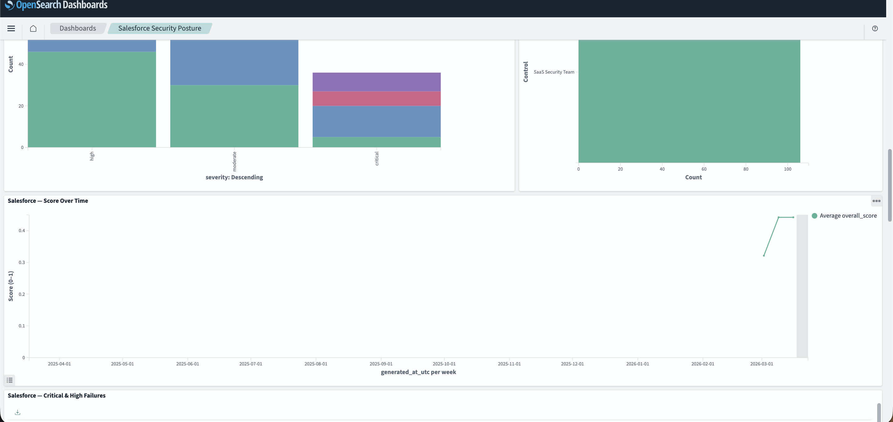
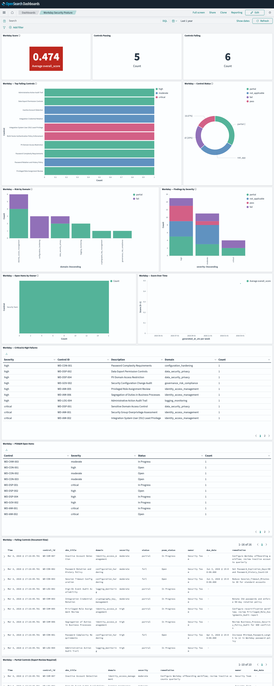
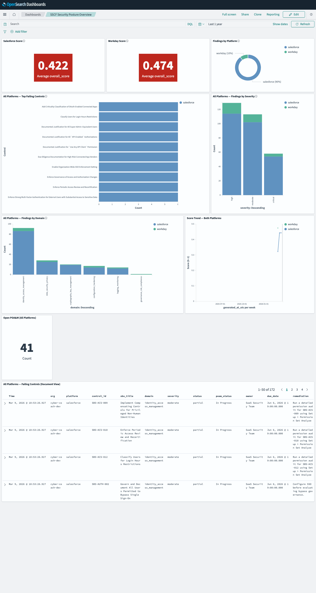

# OpenSearch Dashboards — Setup & Navigation Guide

> **Optional — not required to run assessments.**
> The core pipeline writes JSON, Markdown, and DOCX artifacts that stand on their own.
> This stack adds continuous monitoring, score trending, and cross-org comparison over time.

> **Network security:** All `localhost` URLs in this guide use `http://` because the stack runs
> with `DISABLE_SECURITY_PLUGIN=true` on a private Docker bridge network — dev/internal use only.
> All external API calls (Salesforce, Workday, OpenAI) use HTTPS exclusively.
> **Never expose ports 9200 or 5601 to the internet.**

---

## Screenshots

### Salesforce Security Posture


### Workday Security Posture


### SSCF Security Posture Overview (Combined)


---

## Docker Compose Stack

The Docker Compose file (`docker-compose.yml` in the repo root) defines three services:

```
┌─────────────────────────────────────────────────────────┐
│  Docker Compose Stack                                    │
│                                                          │
│  ┌──────────────────┐   ┌──────────────────────────┐    │
│  │  opensearch      │   │  dashboards               │    │
│  │  port 9200       │◄──│  port 5601                │    │
│  │  sscf-findings-* │   │  OpenSearch Dashboards    │    │
│  │  sscf-runs-*     │   │  2.19.x                   │    │
│  └──────────────────┘   └──────────────────────────┘    │
│           ▲                                              │
│  ┌────────┴──────────┐                                  │
│  │  dashboard-init   │  (runs once, imports NDJSON)     │
│  │  entrypoint.sh    │                                   │
│  └───────────────────┘                                  │
└─────────────────────────────────────────────────────────┘
```

### Services

| Service | Image | Port | Purpose |
|---|---|---|---|
| `opensearch` | `opensearchproject/opensearch:2.19.x` | 9200 | Document store — findings + run metadata |
| `dashboards` | `opensearchproject/opensearch-dashboards:2.19.x` | 5601 | Web UI — all three dashboards |
| `dashboard-init` | `curlimages/curl` | — | One-shot init: imports `dashboards.ndjson` on first start |

### Environment variables (compose)

```yaml
opensearch:
  environment:
    - discovery.type=single-node
    - DISABLE_SECURITY_PLUGIN=true     # dev only — no TLS inside bridge network
    - OPENSEARCH_JAVA_OPTS=-Xms512m -Xmx512m

dashboards:
  environment:
    - OPENSEARCH_HOSTS=http://opensearch:9200
    - DISABLE_SECURITY_DASHBOARDS_PLUGIN=true
```

---

## Starting the Stack

### First start

```bash
# Start all three services
docker compose up -d

# Watch startup logs (OpenSearch takes ~30 s to become healthy)
docker compose logs -f

# Confirm all containers are healthy
docker compose ps
```

Expected output once healthy:

```
NAME                 STATUS
saas-sec-opensearch  Up X minutes (healthy)
saas-sec-dashboards  Up X minutes (healthy)
dashboard-init       Exited (0)             ← success
```

`dashboard-init` exiting with code 0 means all 42 saved objects were imported successfully.

### Health check

```bash
# OpenSearch
curl http://localhost:9200/_cluster/health | python3 -m json.tool

# Dashboards
curl -s http://localhost:5601/api/status | python3 -c "
import sys, json
s = json.load(sys.stdin)['status']['overall']['state']
print('Dashboards status:', s)
"

# Open in browser
open http://localhost:5601
```

### Stopping / restarting

```bash
docker compose stop          # stop without removing volumes
docker compose down          # stop + remove containers (data persists in named volume)
docker compose down -v       # stop + remove containers AND volumes (full reset)
```

---

## What Gets Imported

The `dashboard-init` service imports `config/opensearch/dashboards.ndjson` — 42 saved objects:

| Type | Count | Description |
|---|---|---|
| Index pattern | 2 | `sscf-findings-*` (one doc per finding), `sscf-runs-*` (one doc per run) |
| Visualization | 35 | Score tiles, count tiles, donut pies, hbars, vbars, line trends, agg tables |
| Saved search | 3 | Platform-filtered document views (failing + partial controls) |
| Dashboard | 3 | SSCF Overview, Salesforce Security Posture, Workday Security Posture |

### Index schema

**`sscf-findings-YYYY-MM`** — one document per control finding per assessment run:

| Field | Type | Example |
|---|---|---|
| `assessment_id` | keyword | `sfdc-2026-03-07-001` |
| `org` | keyword | `cyber-coach-dev` |
| `platform` | keyword | `salesforce` or `workday` |
| `generated_at_utc` | date | `2026-03-07T14:22:00Z` |
| `control_id` | keyword | `SBS-AUTH-001` |
| `sbs_title` | text + keyword | `MFA Enforcement` |
| `domain` | keyword | `identity_access_management` |
| `severity` | keyword | `critical` |
| `status` | keyword | `fail` |
| `owner` | keyword | `Security Team` |
| `due_date` | date | `2026-03-14` |
| `poam_status` | keyword | `Open` |
| `remediation` | text | `Enable MFA for all user profiles` |

**`sscf-runs-YYYY-MM`** — one document per full assessment run:

| Field | Type | Example |
|---|---|---|
| `org` | keyword | `cyber-coach-dev` |
| `platform` | keyword | `salesforce` |
| `overall_score` | float | `0.382` |
| `nist_verdict` | keyword | `flag` |
| `pass_count`, `fail_count`, `partial_count` | int | `6`, `15`, `4` |
| `generated_at_utc` | date | `2026-03-07T14:22:00Z` |
| `domain_scores.*` | float | `iam: 0.25`, `logging: 0.60` |

---

## Getting Data In

After every assessment run, export results to OpenSearch:

```bash
# After a live Salesforce run
agent-loop run --env dev --org cyber-coach-dev --approve-critical
python scripts/export_to_opensearch.py --auto --org cyber-coach-dev --date $(date +%Y-%m-%d)
open "http://localhost:5601/app/dashboards#/view/sfdc-dashboard"

# After a Workday dry-run
python3 scripts/workday_dry_run_demo.py --org acme-workday --env dev
python scripts/export_to_opensearch.py --auto --org acme-workday --date $(date +%Y-%m-%d)
open "http://localhost:5601/app/dashboards#/view/workday-dashboard"

# Manual export with explicit paths
python scripts/export_to_opensearch.py \
  --sscf-report docs/oscal-salesforce-poc/generated/<org>/<date>/sscf_report.json \
  --backlog     docs/oscal-salesforce-poc/generated/<org>/<date>/backlog.json \
  --nist-review docs/oscal-salesforce-poc/generated/<org>/<date>/nist_review.json \
  --org <org> --platform salesforce
```

Verify data landed:

```bash
curl http://localhost:9200/_cat/indices | grep sscf
# sscf-findings-2026-03   120 docs
# sscf-runs-2026-03        3 docs
```

---

## The Three Dashboards

### Direct links

| Dashboard | URL |
|---|---|
| **SSCF Security Posture Overview** | http://localhost:5601/app/dashboards#/view/sscf-main-dashboard |
| **Salesforce Security Posture** | http://localhost:5601/app/dashboards#/view/sfdc-dashboard |
| **Workday Security Posture** | http://localhost:5601/app/dashboards#/view/workday-dashboard |
| All dashboards list | http://localhost:5601/app/dashboards |
| Raw document explorer | http://localhost:5601/app/data-explorer/discover |

> **Platform isolation:** Every visualization on the Salesforce dashboard carries a
> `platform : salesforce` KQL filter baked into the viz definition. The Workday dashboard
> carries `platform : workday`. The two dashboards cannot show each other's data.

---

### Salesforce Security Posture (`sfdc-dashboard`)

**Best for:** SBS quarterly reviews, SFDC admin team briefings, pre-audit evidence.

#### Row 1 — At-a-Glance Metrics
| Panel | What it shows |
|---|---|
| **Salesforce Score** | Average overall score across all Salesforce runs — 🔴 RED (< 50%) · 🟡 AMBER (50–75%) · 🟢 GREEN (> 75%) |
| **Controls Passing** | Count of `status : pass` Salesforce controls |
| **Controls Failing** | Count of `status : fail` Salesforce controls |

#### Row 2 — Top Failing Controls (full width)
| Panel | What it shows |
|---|---|
| **Salesforce — Top Failing Controls** | Top 10 fail/partial Salesforce controls by full title, horizontal bars colored by severity. Click any bar to filter the dashboard. |

#### Row 3 — Status & Domain
| Panel | What it shows |
|---|---|
| **Salesforce — Control Status** | Donut: Pass / Fail / Partial / Not Applicable distribution |
| **Salesforce — Risk by Domain** | Stacked vertical bar: fail/partial per SSCF domain, stacked by status. Identifies which security domains carry the most exposure. |

#### Row 4 — Severity & Accountability
| Panel | What it shows |
|---|---|
| **Salesforce — Findings by Severity** | All findings by severity, stacked by status. Shows whether critical/high failures are pass or fail. |
| **Salesforce — Open Items by Owner** | Which owner/team has the most open fail/partial items — for sprint assignment. |

#### Row 5 — Score Trend (full width)
| Panel | What it shows |
|---|---|
| **Salesforce — Score Over Time** | Line chart: average overall_score per assessment date. Track remediation progress or regression. |

#### Rows 6–7 — Detail Tables (full width)
| Panel | What it shows |
|---|---|
| **Salesforce — Critical & High Failures** | Aggregation table: severity · control ID · description · domain for all critical/high fail/partial findings |
| **Salesforce — POA&M Open Items** | Aggregation table: control · severity · POA&M status for all Open/In Progress items |

#### Rows 8–9 — Document Views (full width, sortable)
| Panel | What it shows |
|---|---|
| **Salesforce — Failing Controls** | Every fail/partial row: control_id · title · domain · severity · status · poam_status · owner · due_date · remediation |
| **Salesforce — Partial Controls** | Partial-only rows with remediation note — the expert review queue |

---

### Workday Security Posture (`workday-dashboard`)

**Best for:** WSCC compliance reviews, Workday HCM/Finance security briefings, integration audit prep.

Identical 13-panel layout to Salesforce — all queries filtered to `platform : workday` and `WD-*` controls.

---

### SSCF Security Posture Overview (`sscf-main-dashboard`)

**Best for:** Monthly leadership reviews, cross-platform risk comparisons, executive briefings.

#### Row 1 — Score Comparison
| Panel | What it shows |
|---|---|
| **Salesforce Score** | Average score for all Salesforce runs |
| **Workday Score** | Average score for all Workday runs |
| **Findings by Platform** | Donut: finding count split by platform — shows assessment coverage |

#### Row 2 — Cross-Platform Failures
| Panel | What it shows |
|---|---|
| **All Platforms — Top Failing Controls** | Top 10 fail/partial controls across both platforms, bars split by platform. Reveals controls failing on Salesforce AND Workday simultaneously. |
| **All Platforms — Findings by Severity** | Severity distribution split by platform — shows whether Salesforce or Workday carries more high-severity risk |

#### Row 3 — Domain & Trends
| Panel | What it shows |
|---|---|
| **All Platforms — Findings by Domain** | Fail/partial per SSCF domain, stacked by platform — highlights weakest security domains across all SaaS |
| **Score Trend — Both Platforms** | Line chart with one line per platform — track remediation velocity independently |

#### Row 4 — Governance
| Panel | What it shows |
|---|---|
| **Open POA&M (All Platforms)** | Total open POA&M items across all platforms |

#### Row 5 — Full Document View
| Panel | What it shows |
|---|---|
| **All Platforms — Failing Controls** | Every fail/partial row across all orgs: org · platform · control_id · title · domain · severity · status · owner · due_date · remediation |

---

## Navigating the Dashboards

### Score color thresholds

| Color | Score | Meaning |
|---|---|---|
| 🔴 RED | < 50% | High risk — multiple critical/high failures; immediate action required |
| 🟡 AMBER | 50–75% | Moderate risk — partial controls; remediation plan needed |
| 🟢 GREEN | > 75% | Low risk — most controls passing; minor gaps only |

### Interactivity

- **Click any bar or donut slice** — filters the entire dashboard to that value (e.g. click `critical` to see only critical findings in all panels)
- **Search bar (top)** — add any KQL filter: `org : cyber-coach-dev`, `domain : identity_access_management`, `control_id : SBS-AUTH-001`
- **Time picker** — default is last 1 year; narrow to a specific date to see a point-in-time snapshot
- **Sort document tables** — click any column header to sort by severity, due date, owner, etc.

### "No results" checklist

1. **Time range** — confirm the picker covers the date the assessment was exported
2. **Export ran** — `python scripts/export_to_opensearch.py --auto --org <alias> --date <date>`
3. **Index exists** — `curl http://localhost:9200/_cat/indices | grep sscf`
4. **Platform filter** — if viewing Salesforce dashboard, confirm the finding has `"platform": "salesforce"` in the exported backlog

---

## Regenerating the NDJSON

The saved objects are generated by `scripts/gen_dashboards_ndjson.py` and checked in to
`config/opensearch/dashboards.ndjson`. If you change the dashboard layout or add a platform:

```bash
# Regenerate
python3 scripts/gen_dashboards_ndjson.py

# Re-import into running stack (overwrites existing objects)
curl -X POST "http://localhost:5601/api/saved_objects/_import?overwrite=true" \
  -H "osd-xsrf: true" \
  --form file=@config/opensearch/dashboards.ndjson
```

> **OSD 2.19 note:** Panels must use `panelRefName` (not `id`) in panelsJSON, with a single
> 0-indexed `references` array. Using `id` causes OSD to auto-generate duplicate refs on import,
> which corrupts panel-to-viz resolution. The generator handles this correctly — do not add
> explicit `id` fields to panel objects.

---

## Troubleshooting

| Issue | Fix |
|---|---|
| Dashboards show "No results" | Check time picker; re-run export; verify index with `curl localhost:9200/_cat/indices` |
| Score tiles show "No data" | `sscf-runs-*` index missing — run `export_to_opensearch.py` after assessment |
| `dashboard-init` exited non-zero | Re-run: `docker compose restart dashboard-init` |
| Dashboards not loading after start | Wait 60 s — OpenSearch takes ~30 s to become healthy before dashboards can connect |
| `opensearch-py not installed` | `pip install opensearch-py` or `pip install -e ".[monitoring]"` |
| Port 9200 or 5601 already in use | Stop conflicting service, or change ports in `docker-compose.yml` |
| Apple Silicon (M-series) OOM | `OPENSEARCH_JAVA_OPTS=-Xms256m -Xmx256m` in `docker-compose.yml` |
| Duplicate panels / wrong viz | Re-import: `curl -X POST "localhost:5601/api/saved_objects/_import?overwrite=true" -H "osd-xsrf: true" --form file=@config/opensearch/dashboards.ndjson` |
| Salesforce data on Workday dashboard | KQL platform filter missing — regenerate and reimport NDJSON |
| "Conflict" errors on import | Delete existing objects first: `curl -X POST "localhost:9200/.kibana_1/_delete_by_query" -H "Content-Type: application/json" -d '{"query":{"terms":{"type":["dashboard","visualization","search"]}}}' ` then reimport |
